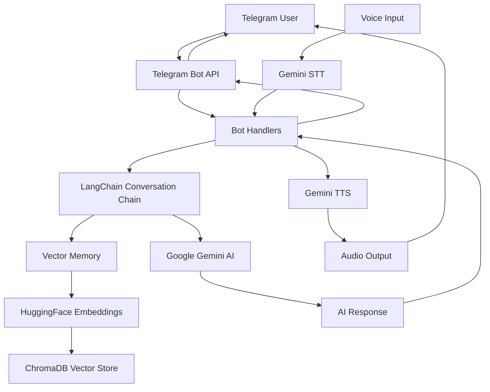

# 🤖 Telegram Gemini AI Bot

<div align="center">


[](https://t.me/your_bot_username)

**An intelligent Telegram bot powered by Google Gemini AI with persistent memory, voice processing, and text-to-speech capabilities**

</div>

---

## 📚 Table of Contents

- [🔍 Overview](#-overview)
- [📋 Prerequisites](#-prerequisites) 
- [🚀 Installation](#-installation)
- [⚙️ Configuration](#️-configuration)
- [📖 Usage](#-usage)
- [📁 File Structure](#-file-structure)
- [🏗️ Architecture](#️-architecture)
- [🔧 Troubleshooting](#-troubleshooting)
- [🤝 Contributing](#-contributing)


---

## 🔍 Overview

This Telegram bot leverages **Google Gemini 2.5 Flash** AI through LangChain to provide intelligent conversational experiences with persistent memory. The bot can process text messages, transcribe voice notes, generate speech audio, and maintain conversation context using ChromaDB vector storage.

### ✨ Key Features

| Feature | Description |
|---------|-------------|
| 🧠 **Persistent Memory** | Conversation history stored in ChromaDB with vector embeddings |
| 🗣️ **Text-to-Speech** | Generate audio responses using Gemini TTS with Kore voice |
| 🎤 **Speech-to-Text** | Transcribe voice messages with high accuracy |
| ⚡ **Fast Responses** | Powered by Gemini 2.5 Flash for quick AI interactions |
| 🔄 **Context Awareness** | Retrieves relevant conversation history for better responses |
| 🛡️ **Error Handling** | Robust error management and user feedback |

---

## 📋 Prerequisites

Before setting up the bot, ensure you have:

- **Python 3.8+** installed on your system
- **Telegram Bot Token** from [@BotFather](https://t.me/botfather)
- **Google Gemini API Key** from [Google AI Studio](https://makersuite.google.com/app/apikey)
- At least **4GB RAM** (for embeddings model)
- **Internet connection** for API calls

### Required API Keys

| Service | Purpose | How to Obtain |
|---------|---------|---------------|
| Telegram Bot API | Bot communication | Create bot via [@BotFather](https://t.me/botfather) |
| Google Gemini API | AI responses & voice processing | Sign up at [Google AI Studio](https://makersuite.google.com/) |

---

## 🚀 Installation

### 1. Clone the Repository

```bash
git clone https://github.com/yourusername/telegram-gemini-bot.git
cd telegram-gemini-bot
```

### 2. Create Virtual Environment

```bash
# Create virtual environment
python -m venv venv

# Activate virtual environment
# On Windows:
venv\Scripts\activate
# On macOS/Linux:
source venv/bin/activate
```

### 3. Install Dependencies

```bash
pip install -r requirements.txt
```

> **Note**: The initial run will download the `instructor-xl` embedding model (~1.3GB). Ensure stable internet connection.

---

## ⚙️ Configuration

### Method 1: API Keys File (Recommended)

Create an `api_keys.py` file in the project root:

```python
# api_keys.py
Telegram_api_key = "your_telegram_bot_token_here"
Gemini_api_key = "your_gemini_api_key_here"
```

### Method 2: Environment Variables

Set environment variables in your system:

```bash
export TELEGRAM_API_KEY="your_telegram_bot_token_here"
export GEMINI_API_KEY="your_gemini_api_key_here"
```

> ⚠️ **Security Warning**: Never commit API keys to version control. Add `api_keys.py` to your `.gitignore` file.

---

## 📖 Usage

### Starting the Bot

```bash
python main.py
```

The bot will start polling for messages and display connection status in the terminal.

### Available Commands

| Command | Description | Example |
|---------|-------------|---------|
| `/start` | Initialize bot and display welcome message | `/start` |
| `/gen_audio <text>` | Generate speech audio from text | `/gen_audio Hello, how are you?` |
| `/gen_text` | Enable voice message transcription | `/gen_text` |
| **Text Messages** | Send any text for AI conversation | `What's the weather like?` |
| **Voice Messages** | Send voice note for transcription (after `/gen_text`) | *Send voice note* |

### Example Workflow

1. **Start conversation**: `/start`
2. **Chat with AI**: `Tell me about quantum physics`
3. **Generate audio**: `/gen_audio Quantum physics is fascinating!`
4. **Enable voice**: `/gen_text`
5. **Send voice note**: *Record and send voice message*

---

## 📁 File Structure

```
telegram-gemini-bot/
├── main.py              # Main bot application with handlers
├── requirements.txt     # Python dependencies
├── api_keys.py         # API keys configuration (create this)
├── db/                 # ChromaDB vector storage directory
│   └── (auto-generated files)
├── README.md           # Project documentation
└── .gitignore         # Git ignore file
```

### File Responsibilities

| File | Purpose |
|------|---------|
| `main.py` | Core bot logic, command handlers, AI integration |
| `requirements.txt` | Python package dependencies |
| `api_keys.py` | API keys storage (user-created) |
| `db/` | Persistent conversation memory storage |

---

## 🏗️ Architecture



### Data Flow

1. **User Input** → Telegram API → Bot Handler
2. **Text Processing** → LangChain → Gemini AI → Response
3. **Memory Storage** → Embeddings → ChromaDB → Persistent Storage
4. **Voice Processing** → Gemini STT/TTS → Audio Response

---

## 🔧 Troubleshooting

### Common Issues

> ⚠️ **Bot Not Responding**
> 
> **Cause**: Invalid Telegram bot token
> 
> 🛠️ **Fix**: Verify token in `api_keys.py` and ensure bot is not already running elsewhere

> ⚠️ **Gemini API Errors**
> 
> **Cause**: Invalid API key or quota exceeded
> 
> 🛠️ **Fix**: Check API key validity and billing status in Google AI Studio

> ⚠️ **Memory Issues**
> 
> **Cause**: Insufficient RAM for embeddings model
> 
> 🛠️ **Fix**: Ensure at least 4GB available RAM or use smaller embedding model

> ⚠️ **Voice Processing Failed**
> 
> **Cause**: Unsupported audio format or file size
> 
> 🛠️ **Fix**: Ensure voice messages are under 20MB and in supported formats

### Debug Mode

Enable verbose logging by modifying the conversation chain:

```python
conversation = ConversationChain(
    llm=LLM,
    memory=memory,
    verbose=True,  # Enable debug output
)
```

### Log Analysis

Check console output for detailed error messages and API response codes.

---


### Development Setup

1. Fork the repository
2. Create a feature branch: `git checkout -b feature/amazing-feature`
3. Make your changes
4. Run tests: `python -m pytest` (if tests exist)
5. Commit changes: `git commit -m 'Add amazing feature'`
6. Push to branch: `git push origin feature/amazing-feature`
7. Open a Pull Request


<div align="center">

**Made with ❤️ by [Adnan](https://github.com/AdnanOdeh04)**

[⭐ Star this repo](https://github.com/yourusername/telegram-gemini-bot) • [🐛 Report Bug](https://github.com/yourusername/telegram-gemini-bot/issues) • [💡 Request Feature](https://github.com/yourusername/telegram-gemini-bot/issues)

</div>